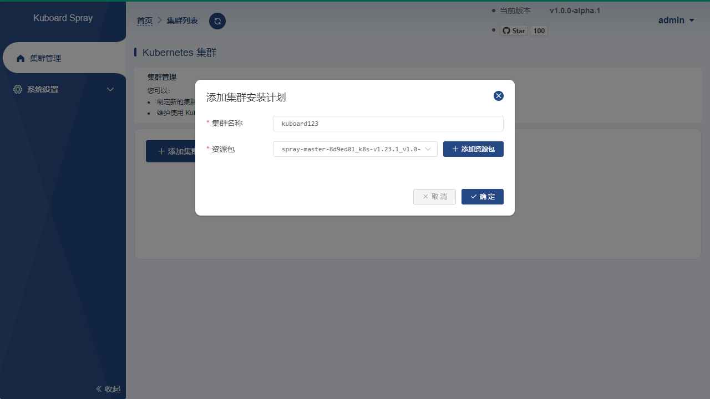
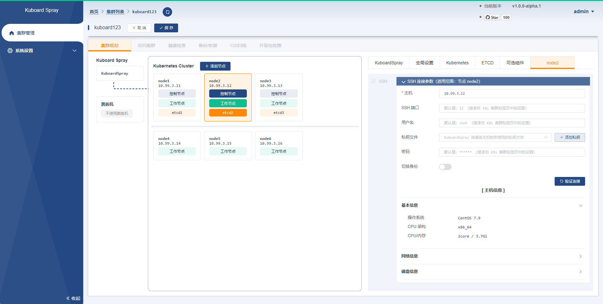
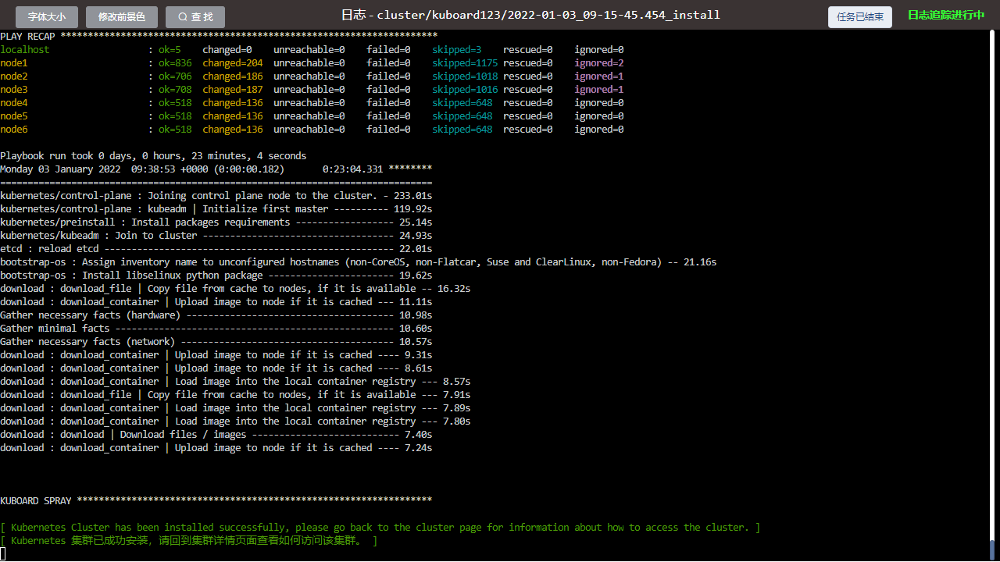
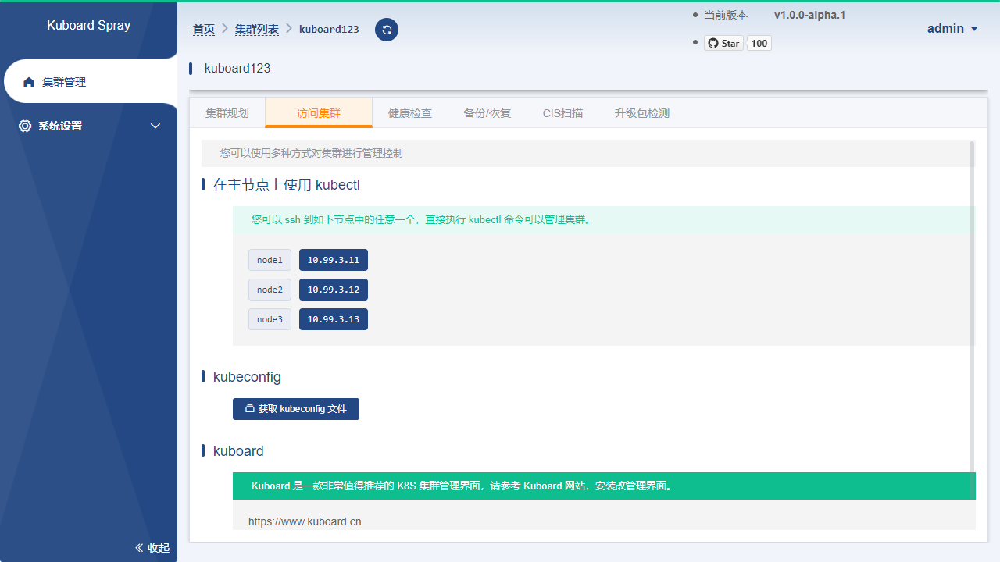

# 离线安装 K8S


## Kuboard-Spray


Kuboard-Spray 是一款可以在图形界面引导下完成 Kubernetes 高可用集群离线安装的工具，开源仓库的地址为 [Kuboard-Spray](https://github.com/eip-work/kuboard-spray) 
<span><iframe style="display:inline-block;vertical-align:middle;" src="https://addons.kuboard.cn/downloads/github-star-kuboard-spray.html" frameborder="0" scrolling="0" width="120" height="20" title="GitHub"></iframe></span>

**安装后的集群版本为**

* Kubernetes v1.23.1 （与您使用的 [资源包版本](../support) 有关）

### 社区

对此项目感兴趣的同学，请点击此处 <span><iframe style="display:inline-block;vertical-align:middle;" src="https://addons.kuboard.cn/downloads/github-star-kuboard-spray.html" frameborder="0" scrolling="0" width="100" height="20" title="GitHub"></iframe></span> 在 GitHub 添加本项目的 Star 以后，扫码加入群聊

<p>
  
</p>

### 配置要求

对于 Kubernetes 初学者，在搭建K8S集群时，推荐在阿里云或腾讯云采购如下配置：（您也可以使用自己的虚拟机、私有云等您最容易获得的 Linux 环境）

* 至少 2 台 **2核4G** 的服务器
* 本文档中，CPU 必须为 x86 架构，暂时未适配 arm 架构的 CPU
* **CentOS 7.8**、 **CentOS 7.9** 或 **Ubuntu 20.04**


[【腾讯云】云产品限时秒杀，爆款1核2G云服务器，首年99元](https://cloud.tencent.com/act/cps/redirect?redirect=1062&cps_key=2ee6baa049659f4713ddc55a51314372&from=console)


**操作系统兼容性**

| CentOS 版本 | 本文档是否兼容                          | 备注                                |
| ----------- | --------------------------------------- | ----------------------------------- |
| CentOS 7.9         | <span style="font-size: 24px;">😄</span> | 已验证                              |
| CentOS 7.8         | <span style="font-size: 24px;">😄</span> | 已验证                              |
| Ubuntu 20.04       | <span style="font-size: 24px;">😄</span> | 已验证                              |

## 安装 Kuboard-Spray

* 取一台服务器或虚拟机，执行一条命令，即可完成 Kuboard-Spray 的安装。

  对这台服务器的最低要求为：
  <div style="font-size: 13px;margin-left: 40px;">

  * 1核2G
  * 不少于 10G 磁盘空余空间
  * 已经安装好 docker

  </div>

  待执行的命令如下：

  ```sh {6,7,8}
  docker run -d \
    --privileged \
    --restart=unless-stopped \
    --name=kuboard-spray \
    -e TZ=Asia/Shanghai \
    -p 80:80/tcp \
    -v /var/run/docker.sock:/var/run/docker.sock \
    -v ~/kuboard-spray-data:/data \
    eipwork/kuboard-spray:latest-amd64  
    # 如果您是 arm64 环境，请将标签里的 amd64 修改为 arm64，例如 eipwork/kuboard-spray:latest-arm64
    # 如果抓不到这个镜像，可以尝试一下这个备用地址：
    # swr.cn-east-2.myhuaweicloud.com/kuboard/kuboard-spray:latest-amd64
  ```
  ::: tip 持久化

  * KuboardSpray 的信息保存在容器的 `/data` 路径，请将其映射到一个您认为安全的地方，上面的命令中，将其映射到了 `~/kuboard-spray-data` 路径；
  * 只要此路径的内容不受损坏，重启、升级、重新安装 Kuboard-Spray，或者将数据及 Kuboard-Spray 迁移到另外一台机器上，您都可以找回到原来的信息；
  * 加个 [GITHUB Star](https://github.com/eip-work/kuboard-spray)，避免迷路。

  :::


* 在浏览器打开地址 `http://这台机器的IP`，输入用户名 `admin`，默认密码 `Kuboard123`，即可登录 Kuboard-Spray 界面。

## 加载离线资源包

* 在 Kuboard-Spray 界面中，导航到 `系统设置` --> `资源包管理` 界面，可以看到已经等候您多时的 `Kuboard-Spray 离线资源包`，如下图所示：

  

* 点击 `导 入` 按钮，在界面的引导下完成资源包的加载。

  ::: tip 重要

  * 权限问题
    * 导入资源包时，可能会碰到 `no such file or directory` 或者 `permission denied` 之类的错误提示，通常是因为您开启了 SELinux，导致 kuboard-spray 不能读取映射到容器 `/data` 的路径
  * 离线导入
    * 如果您处在内网环境，上图中的列表默认将是空的，请注意其中的 `离线加载资源包` 按钮，它可以引导您轻松完成资源包的离线加载过程。

  :::

## 规划并安装集群

* 在 Kuboard-Spray 界面中，导航到 `集群管理` 界面，点击界面中的 `添加集群安装计划` 按钮，填写表单如下：
  * 集群名称： 自定义名称，本文中填写为 kuboard123，此名称不可以修改；
  * 资源包：选择前面步骤中导入的离线资源包。

  

* 点击上图对话框中的 `确定` 按钮后，将进入集群规划页面，在该界面中添加您每个集群节点的连接参数并设置节点的角色，如下图所示：

  重要： kuboard-spray 所在机器不能当做 K8S 集群的一个节点，因为安装过程中会重启集群节点的容器引擎，这会导致 kuboard-spray 被重启掉。
    
    

  ::: tip 注意事项

  * 最少的节点数量是 1 个；
  * ETCD 节点、控制节点的总数量必须为奇数；
  * 在 `全局设置` 标签页，可以设置节点的通用连接参数，例如所有的节点都使用相同的 ssh 端口、用户名、密码，则共同的参数只在此处设置即可；
  * 在节点标签页，如果该节点的角色包含 `etcd` 则必须填写 `ETCD 成员名称` 这个字段；
  * 如果您 KuboardSpray 所在节点不能直接访问到 Kubernetes 集群的节点，您可以设置跳板机参数，使 KuboardSpray 可以通过 ssh 访问集群节点。
  * 集群安装过程中，除了已经导入的资源包以外，还需要使用 yum 或 apt 指令安装一些系统软件，例如 curl, rsync, ipvadm, ipset, ethtool 等，此时要用到操作系统的 apt 软件源或者 yum 软件源。`全局设置` 标签页中，可以引导您完成 apt / yum 软件源的设置，您可以：
    * 使用节点操作系统已经事先配置的 apt / yum 源，或者
    * 在安装过程中自动配置节点的操作系统使用指定的软件源
  * 如果您使用 docker 作为集群的容器引擎，还需要在 `全局设置` 标签页指定安装 docker 用的 apt / yum 源。
    > 如果您使用 containerd 作为容器引擎，则无需配置 docker 的 apt / yum 源，containerd 的安装包已经包含在 KuboardSpray 离线资源包中。

  :::

* 点击上图的 `保存` 按钮，再点击 `执行` 按钮，可以启动集群的离线安装过程，如下图所示：

    


* 取决于您机器的性能和网络访问速度，大概喝一杯茶的功夫，集群就安装好了，安装成功时，日志界面的显示如下图所示：

    

## 访问集群

* 如果集群日志界面提示您集群已经安装成功，此时您可以返回到集群规划页面，此界面将自动切换到 `访问集群` 标签页，如下图所示：
  
  界面给出了三种方式可以访问 kubernetes 集群：
  <div style="font-size: 13px;margin-left: 40px;">

  * 在集群主节点上执行 kubectl 命令
  * 获取集群的 .kubeconfig 文件
  * 将集群导入到 kuboard管理界面

  </div>

  

## 下一步

:tada: :tada: :tada: 

您已经完成了 Kubernetes 集群的安装，下一步请：


<!-- <span v-on:click="$sendGaEvent('安装后求GitHub Star','安装后求GitHub Star','安装后求GitHub Star')"><a href="https://github.com/eip-work/kuboard-press" target="_blank">点击此处，给个GitHub Star</a></span>
支持一下吧，<StarCount></StarCount>这么多人都 star 了呢，怎么能少得了您呢？ -->

[安装 Kuboard - K8s 集群管理界面](https://kuboard.cn/install/v3/install-built-in.html)

[获取 Kubernetes 免费教程](https://kuboard.cn/learning/)


<!-- </div>
</StoryBook> -->
